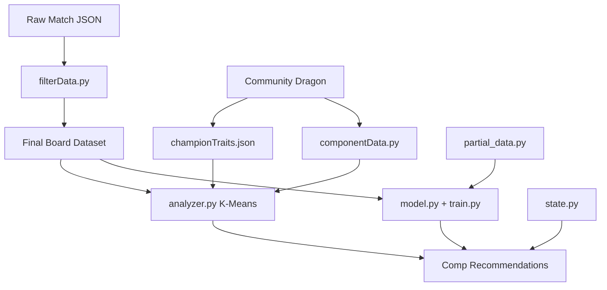

# Board2Placement

Data-driven Teamfight Tactics tooling: scrape high-ELO ranked matches, discover live meta compositions, recommend pivots / item slams from a mid-game board, and predict final placement (1–8).

Currently wired for **Set 18 (Enchanted Wilds) / patch 18.1** via [`settings.py`](settings.py).

This project explores applied ML in a domain with a **finite, structured state space** (units, items, traits, economy) and a clear outcome label (placement). Augments and Wisps are mostly unavailable from the public Riot match API, so the system leans on boards, traits, items, and economy instead of heuristic augment logic.

---

## How It Works

Three layers stack on each other:

1. **Data** — Scrape Challenger ranked matches; convert boards into tensors with economy context and trait vectors.
2. **Meta discovery** — Cluster **top-4** end boards with K-Means into ~15 composition archetypes; learn item slam rates, carries/tanks, trait labels, and emblem needs per archetype.
3. **Recommendation + prediction** — Match a live board + held components + economy to the best comps; suggest craftable item slams; optionally estimate expected placement now and “at cap.”



---

## What Counts as a “Good Composition”?

Comps are **not** hand-authored. They are learned from data:

1. Keep only boards that **finished top 4** in Challenger ranked (`queue_id` 1100).
2. Represent each board as a vector of **unit presence** (cost-weighted) **concatenated with active traits** (style / 4, downweighted in clustering).
3. Run **K-Means** (`CLUSTER_COUNT`, default 15) to find recurring archetypes.
4. For each cluster, build a rich profile (units, traits, items, economy, emblems).

So a “good composition” here means: **a pattern that frequently appears among Challenger top-4 boards on the current patch**, not a named guide from a content site.

When recommending a direction for *your* board, each cluster is scored as:

| Signal | Weight | Meaning |
|--------|--------|---------|
| Item fit (+ craftable slams) | 50% | Your completed / craftable items match what that archetype slamms |
| Economy fit | 30% | Level / gold / stage can realistically reach the archetype’s cost profile |
| Unit fit | 10% | Cosine similarity of your units+traits to the cluster centroid |
| Transition cost | 10% | How many important core units you are still missing (inverted) |

Feasibility labels map economy + transition into `easy` / `medium` / `greedy` / `unrealistic`.

---

## What Each Composition Tells You

Running `BoardFinder().print_good_boards()` (or `python analyzer.py`) prints every learned archetype. Per-cluster fields include:

| Field | Description |
|-------|-------------|
| **display_name** | Human trait label from Community Dragon (e.g. `3 Solar`, `Caustic / Monolith`, `2 Fae (emblem)`) using real `num_units` + breakpoints—not Riot “style” misread as unit count |
| **trait_core_units** | Units that actually hold the cluster’s main traits |
| **splash_units** | Frequent partners that are *not* on those traits (flex / splash) |
| **carries / tanks** | Inferred from offensive vs defensive completed-item slam rates, restricted to frequent trait cores |
| **item_weights / item_lift** | Per-unit slam rates and lift over the global baseline |
| **needs_emblem / emblem_items** | Traits that look emblem-gated (natural holders &lt; breakpoint, or high emblem slam rate) |
| **required_level**, **avg_board_cost**, **count_4cost / count_5cost** | Economy shape of the archetype |
| **core_units** | Full centroid-ranked unit list used for similarity / missing-unit lists |

A live `recommend()` call returns a `CompRecommendation` with score breakdowns, owned/missing cores, recommended crafts (`Make X on Y`), feasibility, and optional **expected** / **projected** placement from the neural net.

---

## Capabilities

### Data pipeline
* Riot TFT API scrape from Challenger ladder, snowballing through match participants
* Set / patch filters (`settings.py`); Unreal-era `game_version` handling
* Scraper resume via checkpoint state file
* Community Dragon: champion→trait map, display names, breakpoints, unique traits, emblem→trait map
* Auto-generated craft recipes (`gen_component_data.py` → `componentData.py`), including Set 18 `DA_*` items and emblems
* Champion-only board filtering (drops non-champ summons when possible)

### Meta / recommender (`analyzer.py`)
* Unsupervised top-4 archetype discovery (units + traits)
* Trait-aware labeling (uniques, breakpoints, display names like Monolith for `DA_18_Battlemage`)
* Item-first matching and memoized DFS component crafting solver
* Economy-aware pivot feasibility
* Emblem-aware trait labels
* Optional placement estimates via loaded `board2placement.pth`

### Placement model (`model.py` / `train.py` / `evaluate.py`)
* Per-slot unit + item embeddings, masked mean over occupied slots
* Economy context: 5-D `[stage, round, progress, level, gold]` (normalized) using the ranked round calendar
* Predicts placement as regression **or** 8-way distribution (default)
* Trains on final boards **plus** synthetic mid-game partials keyed to stage-round (`partial_data.py`)
* Metrics: MAE, top-4 accuracy, exact placement accuracy

### Orchestration
* [`run_pipeline.py`](run_pipeline.py) — scrape (if needed) → champion map → recipes → filter → cluster → train → evaluate → print comps
* [`settings.py`](settings.py) — single place to retarget set / patch / paths / cluster count

### Not in the public API (and therefore not modeled)
* Wisps (Set 18 shop mechanic)
* Reliable augments (often missing)
* Hex positions / positioning

---

## Placement context (5-D) and round calendar

Live and training context is no longer `[stage, level, gold]`. It is a **normalized 5-vector**:

`[stage/7, round/7, progress, level/10, min(gold,100)/100]`

built from a ranked round calendar (stage 1 = four PvE rounds; stages 2–7 = seven rounds each; `progress = abs_round / 46`). Riot `last_round` maps onto that calendar (e.g. `34 → 6-2`). Pass a live clock as `stage`+`round` or `stage_round="3-2"`.

**Final match snapshots** are encoded at a canonical **6-2** clock. `last_round` is elimination time (8ths die around 4-x, 1sts around 6-x), so using it as the live clock leaks placement into the features. Mid-game diversity comes from synthetic 2-1…5-7 partials, which also mask units by **stage-round cost caps** (3-1 ≠ 3-6).

### Comparison vs previous 3-D model

Same Challenger dump, same 64,096-sample mix (finals + 3 partials/board), same eval protocol (full mix, 8-way head):

| | 3-D `[stage, level, gold]` | 5-D calendar (shipped) |
|--|----------------------------|-------------------------|
| MAE | 1.650 | **1.128** |
| Top-4 accuracy | 0.705 | **0.804** |
| Exact placement accuracy | 0.271 | **0.394** |

Validation during the 5-D retrain (held-out 20% of the mix): MAE **1.28**, top-4 **0.765**.

**Same-board probes** (Kayle / Sejuani / Leona / Ornn / Sett / Malphite / Rakan / Xayah, 2★, items on Kayle/Xayah/Sett):

| Clock | Old 3-D expected | New 5-D expected |
|-------|------------------|------------------|
| Stage 3 / 3-1, level 8, 50g (capped, out of distribution) | 7.75 | **5.15** |
| 3-1, level 6, 20g | 7.76 | **5.22** |
| 6-2, level 9, 10g | 7.73 | 7.37 |

That mash-up still does not look like a Challenger-winning endboard to the net. A **real 1st-place** board from the dump scores about **1.3–1.9** across 3-1…6-2; a **real 8th-place** board scores about **6.2–7.9**. Clock now moves predictions, but **board quality dominates** once death-time leakage is removed.

An earlier 5-D experiment that fed Riot `last_round` on finals looked even stronger on 6-2 (~4.0 on the mash-up) because late clocks ≈ winners. That version was discarded.

---

## Project Files

### Configuration

| File | Purpose |
|------|---------|
| [`settings.py`](settings.py) | Committed set/patch paths, cluster count, CDragon URL, match target. |
| [`config.py`](config.py) | Riot API key + region routing (gitignored). Dev keys expire ~24h. Prefer env `RIOT_API_KEY` / `RGAPI_KEY`. |
| [`componentData.py`](componentData.py) | Component set + item recipes for the craft solver (auto-generated). |

### Data Pipeline

| File | Purpose |
|------|---------|
| [`dataScraper.py`](dataScraper.py) | Challenger-seeded match scrape → `data/patch*/`. |
| [`filterData.py`](filterData.py) | Raw JSON → vocab + tensors `(board, context, traits, trait_counts, placement)`. |
| [`state.py`](state.py) | `GameState`, ranked round calendar, parsers, trait encoding, cosine helpers. |
| [`partial_data.py`](partial_data.py) | Synthetic 2-1…5-7 boards for placement training. |
| [`build_champion_map.py`](build_champion_map.py) | Community Dragon → `data/championTraits.json`. |
| [`gen_component_data.py`](gen_component_data.py) | Community Dragon → `componentData.py` recipes. |

### Meta & Modeling

| File | Purpose |
|------|---------|
| [`analyzer.py`](analyzer.py) | K-Means comps, profiles, recommend / craft / print. |
| [`model.py`](model.py) | `Board2Placement` network. |
| [`train.py`](train.py) | Placement training loop. |
| [`evaluate.py`](evaluate.py) | Placement metrics. |
| [`run_pipeline.py`](run_pipeline.py) | End-to-end orchestration. |

### Inference artifacts (committed, ~0.5 MB)

Clone the repo and run recommendations / list comps **without scraping or training**. These files are versioned with the Set 18 / patch 18.1 setup:

| Path | Purpose |
|------|---------|
| [`boardFinder.pkl`](boardFinder.pkl) | K-Means clusters + composition profiles for `recommend()` / `print_good_boards()`. |
| [`board2placement.pth`](board2placement.pth) | Placement network weights (optional expected / projected placement). |
| [`data/IDs`](data/IDs) | Unit / item / trait vocab (name ↔ index). |
| [`data/championTraits.json`](data/championTraits.json) | Champion↔trait static map for labeling. |

### Rebuild-only data (gitignored)

| Path | Purpose |
|------|---------|
| `data/patch18.1/` | Raw match JSON (~tens of MB). |
| `data/cleaned18.1`, `data/cleaned18.1_partial` | Training tensors. |
| `scraperState_patch18.1.json` | Scrape resume checkpoint. |

---

## Usage

### Inference (no API key, no retraining)

```bash
# Needs: torch, scikit-learn, numpy (and requests only if rebuilding)
python analyzer.py   # loads boardFinder.pkl and prints learned comps
```

Recommend from a mid-game state (use Set 18 API unit / component names from `data/IDs`):

```python
from analyzer import BoardFinder
from state import game_state_from_names

finder = BoardFinder()
gs = game_state_from_names(
    unit_names=["DA_18_Kayle", "DA_18_Sejuani", "DA_18_Leona"],
    components={
        "DA_Component_TearOfTheGoddess": 2,
        "DA_Component_NeedlesslyLargeRod": 1,
    },
    ids_file=finder.ids_file,
    stage_round="3-2",
    level=6.0,
    gold=20.0,
)
for rec in finder.recommend(gs, top_k=3):
    print(
        rec.display_name,
        rec.feasibility,
        rec.total_score,
        rec.missing_units[:5],
        [d["readText"] for d in rec.recommended_items],
    )
```

List learned meta comps:

```python
from analyzer import BoardFinder
BoardFinder().print_good_boards()
```

### Rebuild / retrain (needs Riot API key)

```bash
# One-shot
python run_pipeline.py

# Or step by step:
python build_champion_map.py
python gen_component_data.py
python dataScraper.py          # B2P_MATCH_COUNT=2000 by default via settings
python filterData.py
python analyzer.py             # rebuilds boardFinder.pkl, prints comps
python train.py                # rebuilds board2placement.pth
python evaluate.py
```

After retraining, commit the four inference artifacts again so clones stay usable.

* **Language:** Python 3.x
* **ML:** PyTorch, scikit-learn (K-Means), NumPy
* **Data:** Riot TFT API, Community Dragon JSON
* **Networking:** Requests

---

## Status & Roadmap

* Live Challenger scrape + Set 18 preprocessing (traits, counts, DA_* items)
* Trait-aware unsupervised meta discovery with emblem / unique / display-name labeling
* Item-first, economy-aware recommendation + craft solver
* Placement prediction with 5-D stage-round context and synthetic 2-1…5-7 partials
* Future ideas:
  * Joint (level, gold) sampling and trait-preserving filler swaps on synthetic boards
  * Make-vs-wait component decisions
  * Real-time in-game assistant / UI
  * Stronger mid-game labels (manual capture / OCR) instead of synthetic partials
  * Wisps / augments if Riot exposes them

---

## Disclaimer

This project is **not affiliated with or endorsed by Riot Games**.
All game data is accessed via the official Riot API and Community Dragon for educational and analytical purposes.

---

## License

MIT License
