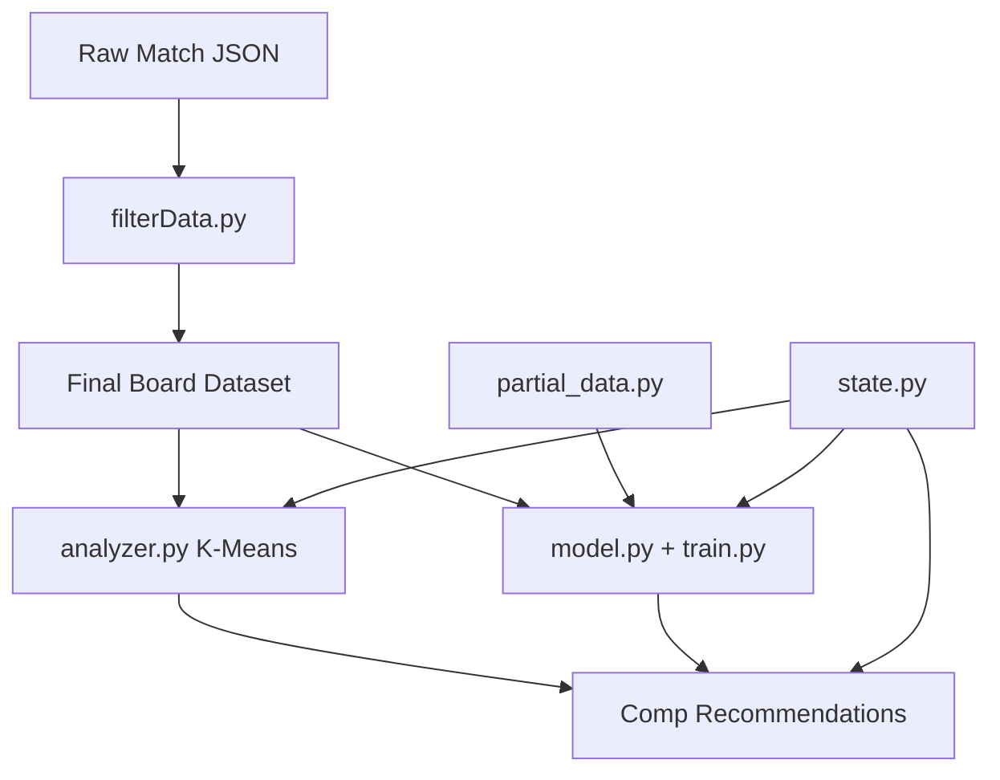

# Board2Placement

This project began as an exploration of **applied machine learning in a domain I was already deeply familiar with**.

I figured that Teamfight Tactics is an especially interesting environment for experimentation because:

* the state space is complex but **finite and well-structured**,
* the number of meaningful features (units, items, traits, positions) is relatively small,
* and outcomes are clearly measurable (placement 1–8).

My guiding belief was that TFT is constrained enough that a machine should be able to find patterns in the decision space and "solve" the game. This was further reinforced by the fact that Riot Games (creator of Teamfight Tactics) removed Augment Data from their public API.

Rather than building a heuristic-heavy system like I tried previously, the goal was to see how far I could get by:

* learning structure directly from data,
* enumerating valid decisions algorithmically,
* and using machine learning to score and compare outcomes.

---

## How It Works

The pipeline has three layers that build on each other:

1. **Data** — Scrape ranked matches, convert them into board tensors with economy context.
2. **Meta discovery** — Cluster top-4 boards into composition archetypes and learn item patterns per comp.
3. **Recommendation + prediction** — Match a player's current board/items/economy to the best comp direction, suggest item slams, and estimate expected placement.



---

## Project Files

### Configuration

| File | Purpose |
|------|---------|
| [`config.py`](config.py) | Holds your Riot API key, region routing (`americas`, `na1`, etc.), and rate-limit settings. Required by `dataScraper.py`. Keys expire every 24 hours on dev accounts. |
| [`componentData.py`](componentData.py) | Static lookup tables for TFT components and item recipes (e.g. Blue Buff = Tear + Tear). Used by the item crafting solver in `analyzer.py`. |

### Data Pipeline

| File | Purpose |
|------|---------|
| [`dataScraper.py`](dataScraper.py) | Crawls the Riot Games API for ranked TFT matches. Seeds from Challenger players, snowballs through match participants, enforces current set/patch filters, and handles rate limits with automatic retries. Saves raw match JSON to `data/patch*/`. |
| [`filterData.py`](filterData.py) | Converts raw match JSON into ML-ready PyTorch datasets. Builds unit/item vocabularies, parses each player's final board and economy context (stage, level, gold), and saves `(board, context, placement)` tuples to `data/cleaned*/`. Optionally generates a partial-game dataset via `partial_data.py`. |
| [`state.py`](state.py) | Shared `GameState` dataclass used across the project. Represents a 14-slot board tensor plus stage, level, gold, and held components. Provides feature helpers (unit vectors, board cost, item assignments, cosine similarity) and parsers for both Riot API JSON and manual unit-name input. |
| [`partial_data.py`](partial_data.py) | Generates synthetic mid-game states from final boards. Because Riot match history only has end-of-game snapshots, this masks expensive units, down-stars units, and converts completed items back to components to simulate Stage 2–5 boards for training the placement model. |

### Meta Discovery & Recommendations

| File | Purpose |
|------|---------|
| [`analyzer.py`](analyzer.py) | The core recommendation engine. Clusters top-4 boards with K-Means, builds rich `ClusterProfile` objects (unit centroids, item lift over global baseline, carry/tank inference, cost/level requirements), and scores candidate comps with weighted item fit (45%), unit fit (25%), economy feasibility (20%), and transition cost (10%). Includes a memoized DFS item crafting solver and returns `CompRecommendation` objects with feasibility ratings, missing units, item slams, and optional expected/projected placement. Saves/loads state to `boardFinder.pkl`. |

### Predictive Modeling

| File | Purpose |
|------|---------|
| [`model.py`](model.py) | PyTorch `Board2Placement` network. Embeds units and items per slot, uses masked pooling (only occupied slots contribute), fuses economy context (stage, level, gold), and predicts either a single placement value or an 8-class placement distribution. Provides `expected_placement()` and `top4_probability()` helpers. |
| [`train.py`](train.py) | Training loop for the placement model. Loads final and partial datasets, splits 80/20 train/validation, trains with Adam + learning rate scheduling, and reports MAE and top-4 accuracy each epoch. Saves best weights to `board2placement.pth`. |
| [`evaluate.py`](evaluate.py) | Standalone evaluation script. Loads a trained model and reports MAE, top-4 accuracy, and exact placement accuracy on the held-out dataset. |

### Generated Artifacts (not in repo)

| Path | Purpose |
|------|---------|
| `data/patch*/` | Raw scraped match JSON from the Riot API. |
| `data/IDs` | Unit and item name → integer ID mappings built by `filterData.py`. |
| `data/cleaned*` | Preprocessed PyTorch datasets (final boards and optional partial states). |
| `boardFinder.pkl` | Saved K-Means model, cluster item weights, and cluster profiles from `analyzer.py`. |
| `board2placement.pth` | Saved placement model weights from `train.py`. |
| `scraperState.json` | Scraper checkpoint (seen matches/players) for resuming downloads. |

---

## Usage

Run the pipeline in order:

```bash
# 1. Set your API key in config.py, then scrape matches
python dataScraper.py

# 2. Preprocess into tensors (also generates partial-game samples)
python filterData.py

# 3. Train composition archetypes (creates boardFinder.pkl if missing)
python analyzer.py

# 4. Train the placement predictor
python train.py

# 5. Evaluate model performance
python evaluate.py
```

Example recommendation from Python:

```python
from analyzer import BoardFinder
from state import game_state_from_names

finder = BoardFinder()
gs = game_state_from_names(
    unit_names=["TFT16_Briar", "TFT16_Draven", "TFT16_Sion"],
    components={"TFT_Item_TearOfTheGoddess": 2, "TFT_Item_NeedlesslyLargeRod": 1},
    ids_file=finder.ids_file,
    stage=3.0, level=6.0, gold=20.0,
)
for rec in finder.recommend(gs, top_k=3):
    print(rec.cluster_idx, rec.feasibility, rec.item_fit, rec.missing_units)
```

---

## Key Capabilities

* **Item-first comp matching** — Items are weighted more heavily than units when identifying which composition a player should commit to, since mid-game unit lineups are often temporary.
* **Economy-aware feasibility** — Penalizes chasing expensive late-game boards when the player is low level or low on gold (e.g. level 6 with 20g should not pivot into a fast 9 legendary board).
* **Dynamic meta adaptation** — Archetypes are learned from live top-4 data, not hardcoded comp names.
* **Recursive item solver** — Explores all valid crafting paths from held components and returns concrete slam recommendations.
* **Partial-state placement prediction** — Trains on synthetic mid-game boards to estimate expected placement from incomplete information.
* **High-ELO bias** — Data is sourced from Challenger-level ranked play.

---

## Tech Stack

* **Language:** Python 3.x
* **Machine Learning:** PyTorch (neural networks), Scikit-Learn (K-Means), NumPy
* **Data Processing:** JSON, PyTorch tensors
* **Networking:** Requests (Riot Games API)

---

## Status & Roadmap

* Live data scraping and preprocessing
* Unsupervised meta discovery with enriched cluster profiles
* Item-aware, economy-aware recommendation engine
* Recursive item crafting solver
* Placement prediction with context features and partial-state training
* Future work:
  * Making items vs waiting for better components
  * Real-time in-game assistant integration
  * User interface
  * Stronger partial-state labels from manual/OCR game capture

---

## Disclaimer

This project is **not affiliated with or endorsed by Riot Games**.
All game data is accessed via the official Riot API and used for educational and analytical purposes.

---

## License

MIT License
